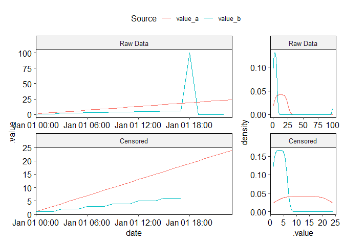
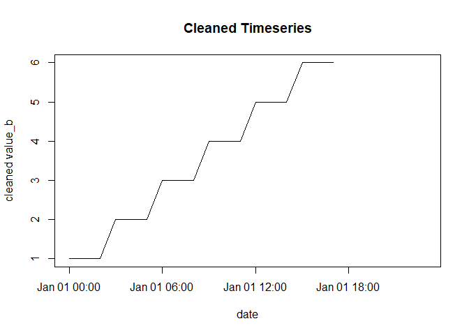

<!-- README.md is generated from README.Rmd. Please edit that file -->

# quacker

<!-- badges: start -->

<!-- badges: end -->

The goal of quacker is to improve the ease and consistency of quality
analysis and quality control (QA/QC) methods used in data science.

quacker is still in active development.

## Installation

You can install the development version of quacker like so:

``` r
# install.packages("pak")
pak::pak("B-Nilson/quacker")
```

## Example

Here is how you can use quaker to QA/QC timeseries data:

``` r
library(quacker)

example_ts <- data.frame(
  date = seq(
    lubridate::ymd_h("2022-01-01 00"),
    lubridate::ymd_h("2022-01-01 23"),
    by = "1 hour"
  ),
  value_a = 1:24,
  value_b = rep(1:6, each = 3) |> c(100, 0, 0, 0, 0, NA)
)

flagged_data <- qaqc_timeseries(
  ts_data = example_ts,
  date_col = "date",
  value_cols = c("value_a", "value_b"),
  allowed_range = c(0, 80),
  allowed_steps = list("1 hours" = 5, "3 hours" = 100),
  allowed_repeats = 3
)

flagged_data |>
  dplyr::select(-"date") |> # for cleaner printing
  print(n = 24)
#> # A tibble: 24 × 6
#>    value_a value_b .flag_value_a .flags_value_a   .flag_value_b .flags_value_b  
#>      <int>   <dbl>         <int> <list>                   <int> <list>          
#>  1       1       1             0 <tibble [1 × 5]>             0 <tibble [1 × 5]>
#>  2       2       1             0 <tibble [1 × 5]>             0 <tibble [1 × 5]>
#>  3       3       1             0 <tibble [1 × 5]>             0 <tibble [1 × 5]>
#>  4       4       2             0 <tibble [1 × 5]>             0 <tibble [1 × 5]>
#>  5       5       2             0 <tibble [1 × 5]>             0 <tibble [1 × 5]>
#>  6       6       2             0 <tibble [1 × 5]>             0 <tibble [1 × 5]>
#>  7       7       3             0 <tibble [1 × 5]>             0 <tibble [1 × 5]>
#>  8       8       3             0 <tibble [1 × 5]>             0 <tibble [1 × 5]>
#>  9       9       3             0 <tibble [1 × 5]>             0 <tibble [1 × 5]>
#> 10      10       4             0 <tibble [1 × 5]>             0 <tibble [1 × 5]>
#> 11      11       4             0 <tibble [1 × 5]>             0 <tibble [1 × 5]>
#> 12      12       4             0 <tibble [1 × 5]>             0 <tibble [1 × 5]>
#> 13      13       5             0 <tibble [1 × 5]>             0 <tibble [1 × 5]>
#> 14      14       5             0 <tibble [1 × 5]>             0 <tibble [1 × 5]>
#> 15      15       5             0 <tibble [1 × 5]>             0 <tibble [1 × 5]>
#> 16      16       6             0 <tibble [1 × 5]>             0 <tibble [1 × 5]>
#> 17      17       6             0 <tibble [1 × 5]>             0 <tibble [1 × 5]>
#> 18      18       6             0 <tibble [1 × 5]>             0 <tibble [1 × 5]>
#> 19      19     100             0 <tibble [1 × 5]>             6 <tibble [1 × 5]>
#> 20      20       0             0 <tibble [1 × 5]>            28 <tibble [1 × 5]>
#> 21      21       0             0 <tibble [1 × 5]>            28 <tibble [1 × 5]>
#> 22      22       0             0 <tibble [1 × 5]>            28 <tibble [1 × 5]>
#> 23      23       0             0 <tibble [1 × 5]>            24 <tibble [1 × 5]>
#> 24      24      NA             0 <tibble [1 × 5]>             1 <tibble [1 × 5]>

plot(
  x = flagged_data$date,
  y = flagged_data$value_b,
  type = "l",
  main = "Noisy Timeseries",
  ylab = "raw value_b",
  xlab = "date"
)
```



``` r

plot(
  x = flagged_data$date,
  y = flagged_data$value_b |> handyr::swap(flagged_data$.flag_value_b > 0, with = NA),
  type = "l",
  main = "Cleaned Timeseries",
  ylab = "cleaned value_b",
  xlab = "date"
)
```


